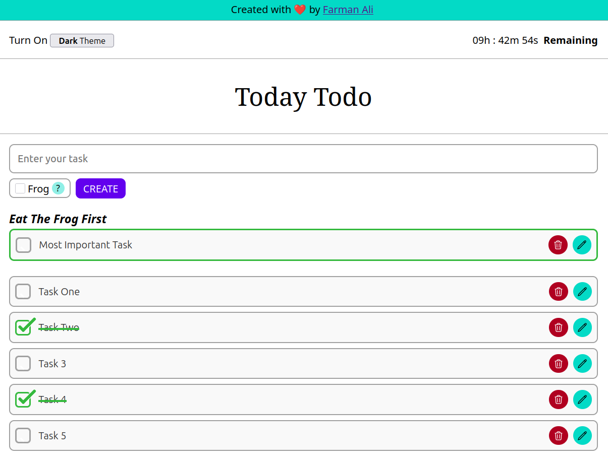

# 🗓️ Today Todo

### 🔗 Live Link

- [🌐 Live Site](https://todaytodo1.netlify.app/)
- [📂 GitHub Repo](https://github.com/farmanali6349/todaytodo)

## 📌 Overview

**Today Todo** is a powerful yet minimal **daily task management app** built with **React.js**, designed to simplify your workflow and **boost productivity**. With helpful features like timers, smart prioritization, and theme customization, it’s your perfect companion for making the most out of every single day.

✨ Key Features

1. 💾 **Local Storage Support**  
   Your tasks are saved in your browser’s **local storage**, so nothing gets lost — even when you refresh or close the browser.

2. 🌗 **Light & Dark Theme**  
   Choose a theme that suits your mood or lighting. Switch seamlessly between **light** and **dark** modes for a better experience.

3. ⏳ **Daily Countdown & Task Timer**  
   Stay mindful of your time!

   - A **countdown timer** shows how much time is left in the day.
   - Each task also gets a **time estimate** to help you complete your list efficiently.

4. 🐸 **"Eat the Frog First" Strategy**  
   Inspired by Brian Tracy’s _Eat That Frog_, this feature ensures your **most important task** is done first. When activated, the app will **automatically prioritize** and move your toughest task to the top.

5. ✅ **Core Task Management Functionalities**  
   Manage your daily goals with ease:
   - **Create** – Add new tasks
   - **Update** – Edit existing tasks
   - **Delete** – Remove completed or irrelevant ones

## 💬 Motivation

This project was created to go **beyond just another to-do app**. I wanted to implement features that encourage **smart planning**, **time management**, and **user empowerment**. It’s designed to help you win the day—every day.

## 🛠️ Tech Stack

- **React.js** – Component-based UI and state management
- **CSS** – Styling for responsive and theme-friendly UI
- **JavaScript (ES6)** – Logic and interactivity
- **Local Storage API** – Persistent data storage
- **VS Code** – My development environment

## 📸 Screenshot

## 🗓️ Published On

**Jan 26, 2025**
